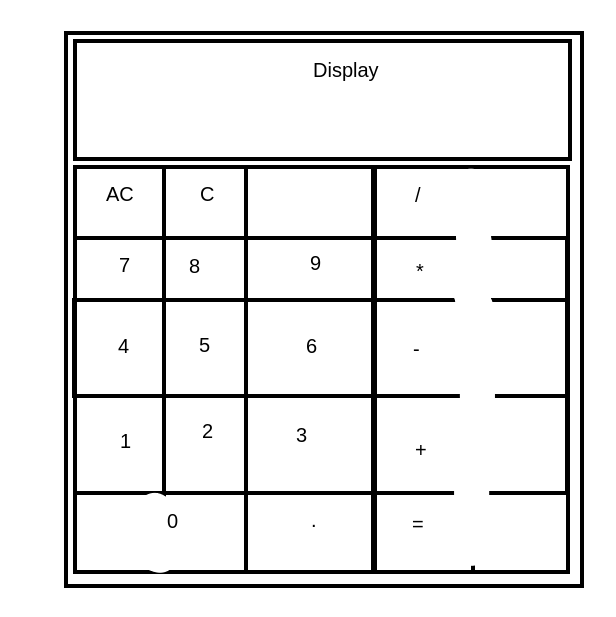

# js-calculator

Calculator application written with HTML, CSS and Javascript.

## Features

### Standard

- Functionality to add, subtract, multiply and divide
- Classic calculator interface written in HTML and CSS
- User can string several operaitns together e.g. 12 + 7 - 5 * 3 = 42
- Don't allow division by 0
- Round long decimal numbers
- Evaluate no more than a single pair of numbers at a time. E.g. 12 + 7 * 3 = 57 should evaluate as 12 + 7 = 19 then 19 * 3 = 57.

### Extra-Credit

- Floating point numbers
- Backspace/Clear button
- Keyboard support

### Rough Plan

1. Write functions for operations
  - Addition
  - Subtraction
  - Multiplication
  - Division
2. Create interface with minimal design
  - 0-9 digit buttons
  - Operation buttons (+ - * / . = C)
  - Display panel
3. Wire up interface to logic and build out full functionality
4. Apply style and design to interface

#### Rough design
